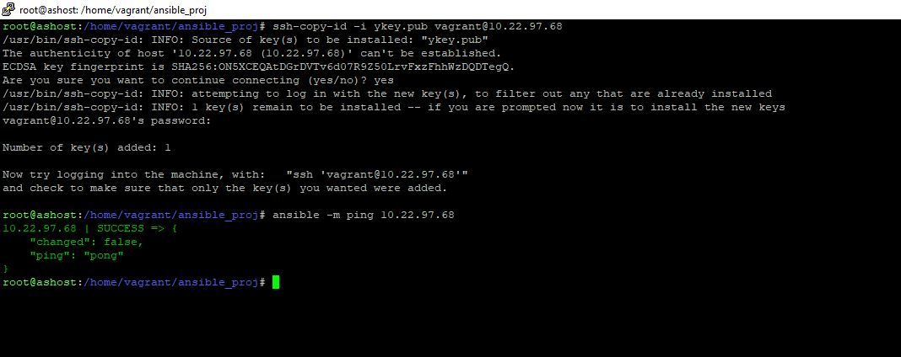

# Домашнее задание к занятию 2. «Применение принципов IaaC в работе с виртуальными машинами», Лебедев А.И., fops-10  

## Задача 1

- Опишите основные преимущества применения на практике IaaC-паттернов.
- Какой из принципов IaaC является основополагающим?

### Ответ:    

 - Преимущества IaaC включают повышенную автоматизацию, управление конфигурациями, масштабируемость и документирование инфраструктуры. Основополагающим принципом IaaC является описание желаемого состояния инфраструктуры в виде кода, т.н. декларативный метод.

---

## Задача 2

- Чем Ansible выгодно отличается от других систем управление конфигурациями?
- Какой, на ваш взгляд, метод работы систем конфигурации более надёжный — push или pull?

### Ответ:    

- Низкий порог вхождения инженера, не неужно ставить клиента на удаленный (управляемый) хост, огромная библиотека модулей.

- С удивлением узнал, что более надежной считается pull-конфигурация.

---

## Задача 3

Установите на личный linux-компьютер(или учебную ВМ с linux):

- [VirtualBox](https://www.virtualbox.org/),
- [Vagrant](https://github.com/netology-code/devops-materials), рекомендуем версию 2.3.4(в более старших версиях могут возникать проблемы интеграции с ansible)
- [Terraform](https://github.com/netology-code/devops-materials/blob/master/README.md)  версии 1.5.Х (1.6.х может вызывать проблемы с яндекс-облаком),
- Ansible.

*Приложите вывод команд установленных версий каждой из программ, оформленный в Markdown.*

## Задача 4 

Воспроизведите практическую часть лекции самостоятельно.

- Создайте виртуальную машину.
- Зайдите внутрь ВМ, убедитесь, что Docker установлен с помощью команды
```
docker ps,
```
Vagrantfile из лекции и код ansible находятся в [папке](https://github.com/netology-code/virt-homeworks/tree/virt-11/05-virt-02-iaac/src).

Примечание. Если Vagrant выдаёт ошибку:
```
URL: ["https://vagrantcloud.com/bento/ubuntu-20.04"]     
Error: The requested URL returned error: 404:
```

выполните следующие действия:

1. Скачайте с [сайта](https://app.vagrantup.com/bento/boxes/ubuntu-20.04) файл-образ "bento/ubuntu-20.04".
2. Добавьте его в список образов Vagrant: "vagrant box add bento/ubuntu-20.04 <путь к файлу>".

Важно!: Если ваша хостовая рабочая станция - это windows ОС, то у вас могут возникнуть проблемы со вложенной виртуализацией.  [способы решения](https://www.comss.ru/page.php?id=7726)  . Если вы устанавливали hyper-v или docker desktop то  все равно может возникать ошибка: Stderr: VBoxManage: error: AMD-V VT-X is not available (VERR_SVM_NO_SVM) . Попробуйте в этом случае выполнить в windows от администратора команду: "bcdedit /set hypervisorlaunchtype off" и перезагрузиться

***Приложите скриншоты в качестве решения на эту задачу. Допускается неполное выполнение данного задания если не сможете совладать с Windows.***   

### Решение задачи 3 и 4:  

- Ввиду того, что курс "DevOps инженер с нуля" подразумевал первым годом обучения сисадминский модуль, а также выполнения заданий с использованием ансибл (довольно часто, я его использовал сам, чтобы попрактиковаться), у меня сложилась следующая конфигурация (использование вагранта не предполагалось, но я его использовал для разворота машин на виртуалбоксе):

1. Вагрант установлен на windows-хосте
2. Вагрант разворачивает линукс-машины на виртуалбоксе, установленном на windows-хосте
3. Терраворм и ансибл разнесены по двум разным виртуальным машинам, что я считаю правильным подходом

- Итак, до селе я пользовался, примерно следующей (очень простой) конфигурацией вагрнат-файла:

```
config.vm.define "elastic" do |elastic|
    elastic.vm.hostname = "elastic"
    elastic.vm.box = "generic/debian10"
    elastic.vm.network "public_network"
config.vm.network "public_network", bridge: "Intel(R) Ethernet Connection I219-LM"
    config.vm.provider "virtualbox" do |vb|
    vb.memory = "2048"
    vb.cpus = "1"
  end
end
```

- Данной конфигурации мне вполне хватало для разворота одной машины. Для разворота нескольких машин я использовал несколько одинаковых модулей.

- Ввиду особенностей моей конфигурации, я позволил себе изменить представленную конфигурацию вагрант-файла. Я закомментил некоторые не нужные переменные и параметры и удалил модуль провизионера, т.к. ансибл, как я сказал ранее, живет у меня на другой машине. Далее - измененный код с пояснениями:

```
# -*- mode: ruby -*-

#ISO = "bento/ubuntu-20.04" - убрал переменную, т.к. подумал, что пусть он закачает дистрибутив во время установки
#NET = "192.168.56." - убрал, так как всегда прокидываю бриджом машину в рабочую сеть и позволяю dhcp сделать свое дело. В целом, можно было бы оставить и создать третий сетевой интерфейс
DOMAIN = ".netology"
HOST_PREFIX = "server"
#INVENTORY_PATH = "../ansible/inventory" - ансибл на другой машине

servers = [
  {
    :hostname => HOST_PREFIX + "1" + DOMAIN,
    #:ip => NET + "11", - выше отметил, почему закомментил
    :ssh_host => "20011",
    :ssh_vm => "22",
    :ram => 1024,
    :core => 1
  }
]

Vagrant.configure(2) do |config|
  #config.vm.synced_folder ".", "/vagrant", disabled: false - здесь я не совсем понял, зачем мы синхронизируем папку с хоста на вм, но, возможно, это правило хорошего тона..объясните? 
  servers.each do |machine|
    config.vm.define machine[:hostname] do |node|
      node.vm.box = "bento/ubuntu-20.04" - закачиваем образ
      node.vm.hostname = machine[:hostname]
      node.vm.network "public_network", bridge: "Intel(R) Ethernet Connection I219-LM" - бридж на сетевой адаптер с dhcp
      node.vm.network :forwarded_port, guest: machine[:ssh_vm], host: machine[:ssh_host]
      node.vm.provider "virtualbox" do |vb|
        vb.customize ["modifyvm", :id, "--memory", machine[:ram]]
        vb.customize ["modifyvm", :id, "--cpus", machine[:core]]
        vb.name = machine[:hostname]
      end
      
    end
  end
end
```

- Собственно, все развернулось:

   

- Что я могу добавить. Думаю, т.к. это хашикорповское детище, то, наверняка здесь как-то может работать провизионер по типу remote-exec и мы можем как-то забрать выданный ip-адрес в inventory на ансибл-хост и вообще изменить модуль провизионера, чтобы запускать ансибл с удаленной машины. Но я не разбирался пока так глубоко. Может, кстати, я и ошибаюсь и вагрант, в отличие от терраформа так не умеет.

- Теи не менее, все же, один момент я доработал! :) Пришлось гуглить и несколько раз пробовать и был создан вот такой маленький скрипт:

```
#!/bin/bash
echo "IP Address: $(hostname -I | awk '{print $2}')"
```

- Который мы подкинули на виртуалку и запустили, дописав в вагрантфайл несколько строк:

```
node.vm.provision "file", source: "./show_ip.sh", destination: "/tmp/show_ip.sh"
node.vm.provision "shell", inline: "/bin/bash /tmp/show_ip.sh", run: "always", privileged: false
```

- Что мы получили в итоге?) Вот это:

   

- Не будем трогать вновь-развернутую машину, а пойдем сразу на ансибл хост. Добавим нужный айпи с параметрами в иевентори, прокинем ключ и пинганем:

  

    

- Отлично. Что ж. Запустим наш плэйбук:

  

- Плэйбук я тоже чуть отредактировал и выглядит он вот так:

```
---

  - hosts: server1
    become: yes
    become_user: root
    remote_user: vagrant

    tasks:
      - name: Checking DNS
        command: host -t A google.com

      - name: Installing tools
        apt: >
          package={{ item }}
          state=present
          update_cache=yes
        with_items:
          - git
          - curl

      - name: Installing docker
        shell: curl -fsSL get.docker.com -o get-docker.sh && chmod +x get-docker.sh && ./get-docker.sh

      - name: Add the current user to docker group
        user: name=vagrant append=yes groups=docker


      - name: Do docker version
        shell: "docker --version"
        register: docker

      - name: Display docker version
        debug:
          var: docker.stdout_lines
```

- Я убрал все, что касается ssh-ключей, т.к. я туда уже положил нужный мне ключ и добавил таску по выводу версии доккера на удаленной машине.


 


